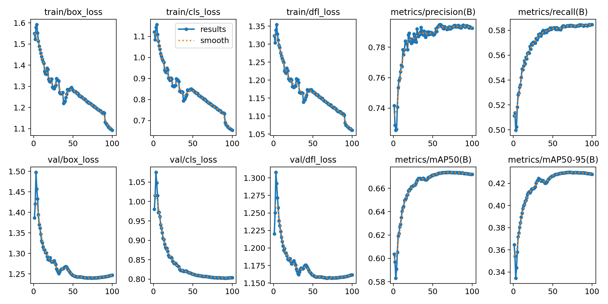
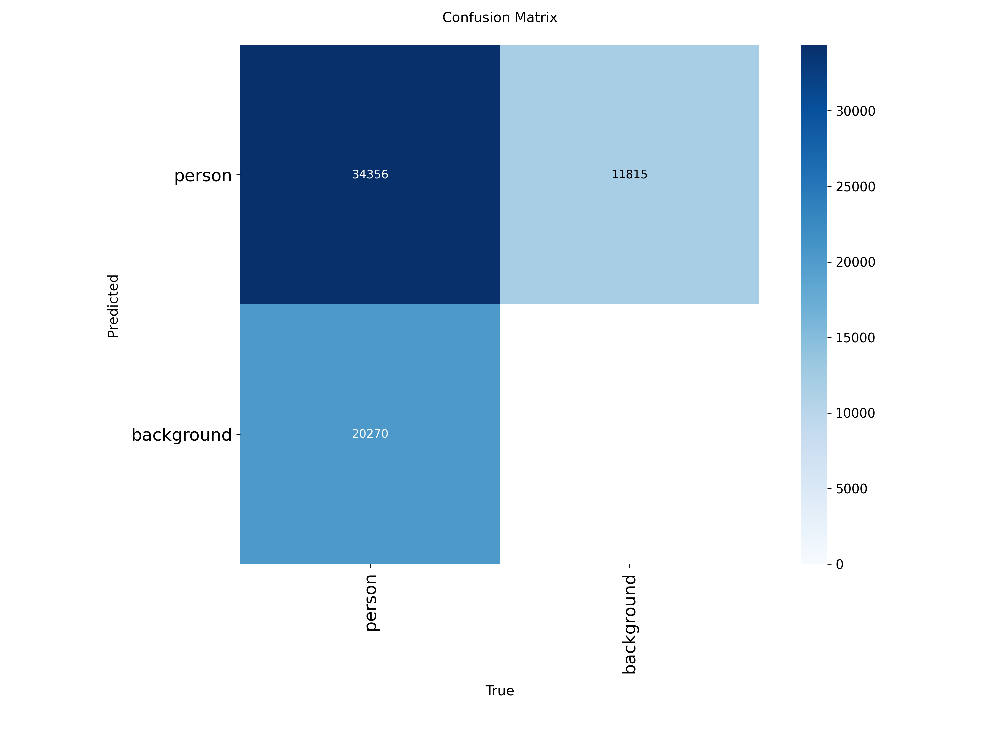
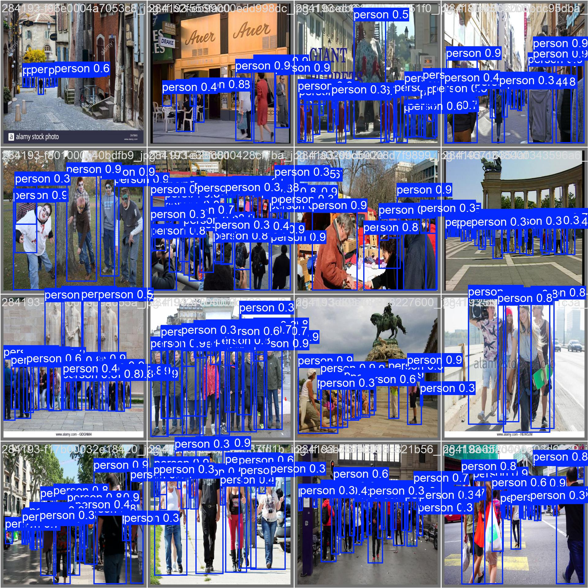
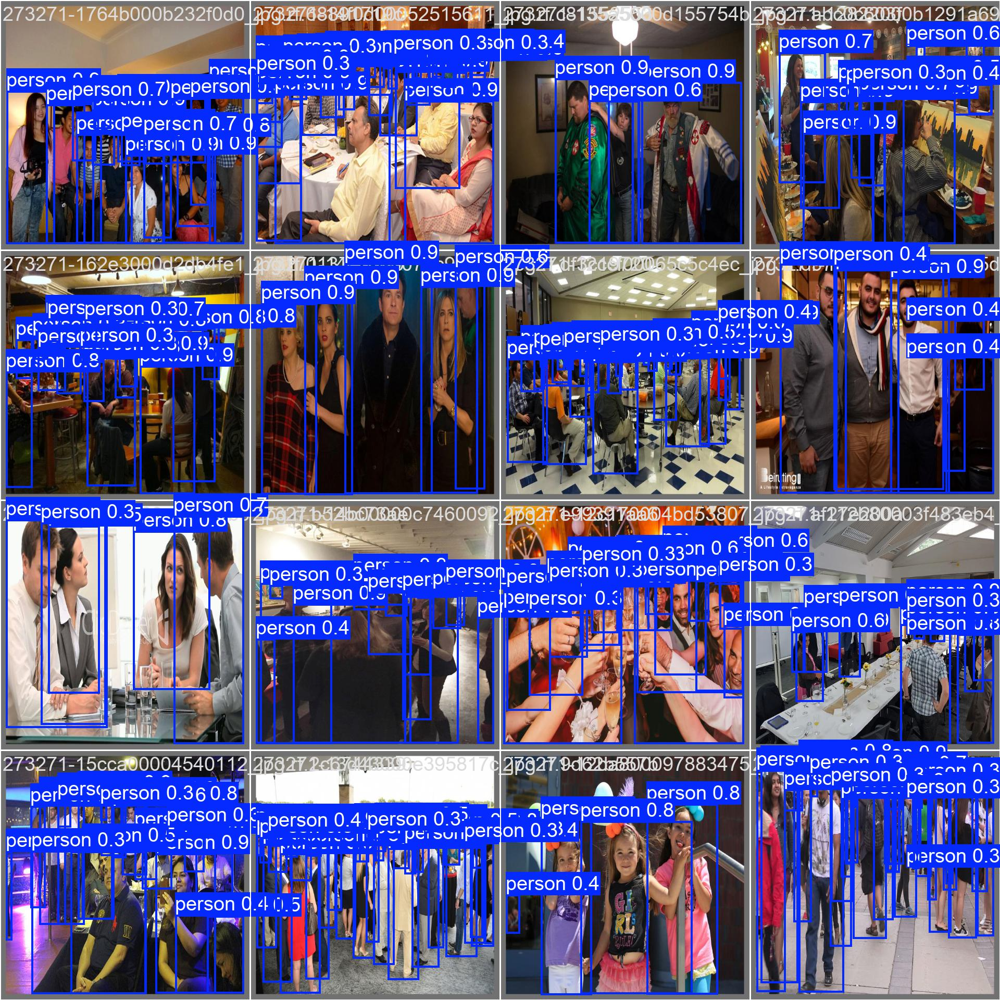

# Model Training & Benchmarking Summary

## 1. Executive Summary
This document outlines the training, evaluation, and optimization pipeline for the crowd detection module of the Crowd Analytics system. A YOLOv8-Small architecture was fine-tuned on the CrowdHuman dataset to prioritize a high frame-rate (FPS) while maintaining robust detection in heavily occluded environments. The final model was exported to an FP16 TensorRT engine, achieving **~133 FPS** with an **mAP50 of 0.674**.

## 2. Dataset & Preparation
* **Dataset:** CrowdHuman (YOLOv8 format)
* **Domain Context:** High-density, heavily occluded pedestrian detection.
* **Training Set:** 19,204 images
* **Validation Set:** 1,857 images
* **Total Validation Instances:** 54,626 bounding boxes

## 3. Training Configuration
* **Architecture:** YOLOv8 Small (`yolov8s.pt`)
* **Model Hyperparameters:**
  * **Optimizer:** Stochastic Gradient Descent (SGD) with Momentum (0.937)
  * **Learning Rate:** 0.01 with a cosine decay schedule
  * **Weight Decay:** 0.0005
* **Model Size:** 7.5 million parameters 
* **Hardware:** NVIDIA GeForce RTX 5060 Laptop GPU (8GB VRAM)
* **Training Duration:** 100 Epochs 
* **Batch Size:** 8 
* **Input Resolution:** 640x640

### Augmentation Strategy
The default augmentation pipeline of YOLOv8 was employed,
* **Mosaic (1.0):** Combines 4 training images into one, teaching the network to identify objects at a smaller scale and ignore arbitrary image borders.
* **Spatial Transforms:** Random Translation (10%), Scale adjustments (50%), and Horizontal Flipping (50%).
* **Color Space (HSV):** Hue (1.5%), Saturation (70%), and Value/Brightness (40%) shifts to ensure robustness against varying indoor/outdoor lighting.
* **Random Erasing (0.4):** Artificially introduces occlusion, forcing the network to recognize partial human features rather than relying on full-body visibility.

## 4. Final Evaluation Metrics
The model achieved highly competitive results on the validation set, especially given the extreme occlusion inherent to the CrowdHuman dataset.

| Metric | Score |
| :--- | :--- | 
| **mAP50** | **0.674** |
| **mAP50-95** | 0.430 | 
| **Recall (R)** | 0.584 | 
| **Precision (P)** | 0.794 |

## 5. Training Visualizations

### Loss Curves & Metrics
*The training and validation loss curves demonstrate healthy convergence without severe overfitting.*

### Confusion Matrix
*Evaluation of classification accuracy across the 'person' class vs background.*

### Sample Validation Predictions
*Ground truth vs. Model predictions on high-density validation batches.*

---

## 6. Inference Benchmarking (ONNX vs TensorRT)
To fulfill the requirement for real-time video processing, the PyTorch weights (`best.pt`) were exported and benchmarked across two different backends. Testing was conducted over 300 frames with a 30-frame warmup period.

| Metric                   | ONNX Runtime | TensorRT |     % Change     |
| :----------------------- | :----------: | :------: | :--------------: |
| Precision                |     FP32     |   FP16   | −50% (bit-width) |
| Mean Inference Time (ms) |     12.48    |   7.47   |      −40.14%     |
| FPS                      |     80.08    |  133.79  |      +67.06%     |
| Max Latency (ms)         |     17.32    |   18.21  |      +5.14%      |
| Avg Detections/Frame     |     256.7    |   257.7  |      +0.39%      |
| GPU Memory (MB)          |     0.16     |   4.85   |     +2931.25%    |

## 7. Architectural Conclusion & Engine Selection
The **TensorRT FP16 engine** (`best.engine`) was selected as the final production model for the inference pipeline. 

As demonstrated by the `Avg Detections` metric (256.7 vs 257.7), quantizing the model from FP32 to FP16 resulted in **zero loss of detection accuracy** while boosting the inference throughput from 80 FPS to **133 FPS**. This massive computational headroom allows the downstream Python threads (ByteTrack association and Shapely optical flow mathematics) to execute without bottlenecking the system, easily satisfying the real-time processing constraint for the final output.